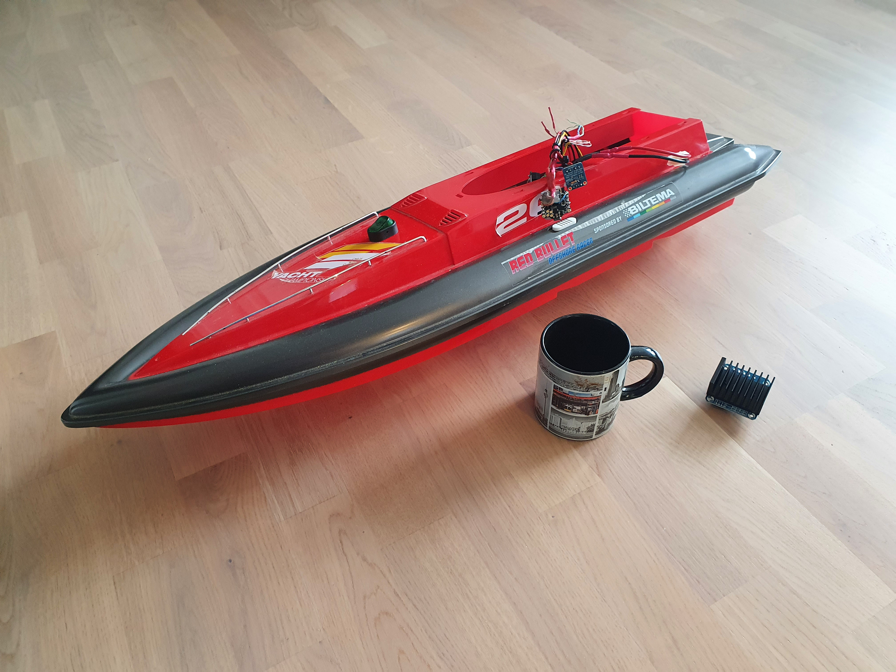
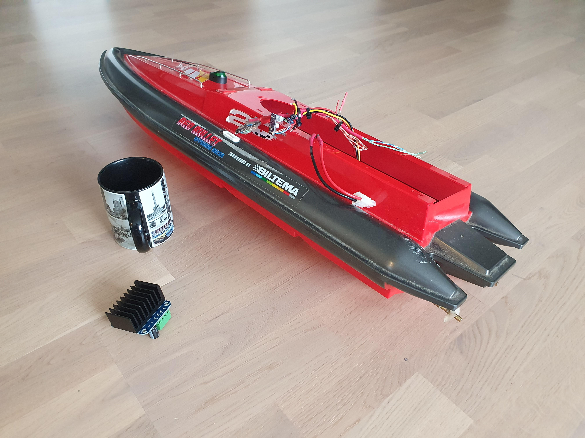

# RcBoatController

## Overview

## Hardware

### History
The boat frame has been apparently bought originally from Biltema some years ago. At some point, the radio controller had been lost, as well as the battery. The boat body was then handed by the original owner to my father-in-law who is known as a man who can fix anything. The boat was stored for some time as a "future project" and then handed to me later.
I googled a bit and didn't find much info of the boat, neither were the suitable radio controllers available on ebay. So, it started look like a DIY project.

### Boat frame
The boat frame is made of plastic and being relatively big, it has plenty of space for new things. The propellers, axles and motors were in good shape, so I saved them and removed the rest: original speed controller and wiring.

### Motors
The model/manufacturer of motors is not known, but they are pretty normal brushed DC motors. Using a lab power supply, it looks like they operate nicely at around 8 volts. More than that makes them run "too fast". Unfortunately, my power supply can deliver only 5A, so I was not able to measure the peak current consumption of the power line, but the motor behaviour seems to be significantly bigger than 5A per motor. Naturally, the current consumption is dependent on the situation. At start-up and in low duty cycle PWM drive, the current consumption is jumpy.

### Power supply
Knowing the desired voltage being ~8V and current consumption being more than 5A per motor, choosing li-ion cells in 2S configuration was quite a clear choice. For safety purpose, I prefer using protected cells. On the other hand, those protection circuits typically limit the output current. The cells I chose were rated at 10A max, so I decided to use four of them in 2S2P configuration. This setup should be fine to keep the motors running nicely.

The cells are kept together in a DIY holder. I bought the holders from ebay, but they were meant for relatively low current use, so I modified them with thicker current lines, again hidden behind a layer of hot glue.

### Power output circuit
At first, I used [DRV8871](https://www.ti.com/product/DRV8871)-based H-bridges to run the motors. They almost worked, but the driver chip got overheated and the current limiting protection activated too often, causing the motor to get jumpy and slow down occasionally during run.
After measuring the current consumption, it became clear that stronger driver circuits are needed. I ended up using [BTS7960](https://www.partco.fi/en/electromechanics/motors/motor-controllersdrivers/19263-bts7960b-modul.html)-based bridges, one per motor. They are too big for this purpose, but the boat benefits from some added middle weight and they fit nicely, so let them be. I have never got the cooling elements to heat up noticeably, so I almost believe they could be run even without the heat sinks in this use case.

### Radio control
I was told that the original product had a two lever controller, supposed to be used by two hands - one controlling the left side motor, the other one controlling the right side motor. I'm not a big fan of such control, so it was natural to go for a bit more user friendly approach for the replacement.
I found a controller+receiver kit for RC cars (see [here](https://www.rhs.fi/rc-tarvikkeet-1/radiolaitteet/radio/muut/maxam-e0105-xt-16-2-4ghz-3-kanals-rattradio.html)).

The kit works well and it was easy to interact with. The datasheet didn't tell much, but the output signals connected to an oscilloscope made it clear. Both channels provide a periodic pulse at 60Hz interval. The length of the pulses vary between ~1000us...~2000us, which made it straight forward to convert the pulse lengths to lever percentages.

### Speed feedback sensor
Being an engineer who enjoys over solved problems, I decided to add speed encoders to both axles to enable the controlled speed balancing of the motors. The main goal was to get the boat to run straight when not intentionally steered anywhere.

There was no space or suitable holder for mounting a normal rotary encoder disc, so I decided to create a DIY version of it. There were some [NERF darts](https://www.hasbro.com/common/productimages/fi_FI/CCCE147C5056900B10553FA593C070AD/converted1ffcb02be85a88a948de298296f6b2eaec526f63.jpg) available at my house, so I used one of them. Painted in matte black, glued with four narrow stripes of aluminium foil and sliding it on the axle, I ended up having something that can be used as an encoder. The only thing needed was an optical detector, where a pair of [CNY70's](https://www.vishay.com/docs/83751/cny70.pdf) became handy. One revolution makes the detector to see eight state transitions (dark->lit->dark->lit etc), which can then be counted by the microcontroller and converted to speed. Naturally, this kind of feedback sensor is not aware of direction of movement, but for the given use case, the directionless speed information was considered enough.

### Microcontroller board
I had some DFRobot Bluno Beetle boards as a leftover from earlier projects. That board has the ATMega 328P controller with a decent development board with enough connectivity around it, so I decided to use it for this. Being Arduino Uno compatible, the Arduino tool chain was the easiest way to get started.

The board is shown here:

### Schematics
The full schematic in PDF format is available [here](https://github.com/djtremolo/RcBoatController/blob/main/doc/schematics/schematic.pdf). Below, it is walked through in sections for convenience.

#### Power supply
First of all, the power supply consists of 2S2P li-ion cells and the output voltage is provided in BAT and GND nets:

#### Controller board
The main controller (Bluno Beetle) is fed with the battery voltage via VIN. Bluno then regulates it to 5V, which is then provided as output for the other boards via the 5V pin.

The used connections:
| Net | Bluno label | Direction | Signal Type | Usage |
| -- | -- | -- | -- | -- |
| MotL1 |A0 | OUT | Digital | PWM signal A for left motor driver |
| MotL2 |A1 | OUT | Digital | PWM signal B for left motor driver |
| MotR1 |A2 | OUT | Digital | PWM signal A for right motor driver |
| MotR2 |A3 | OUT | Digital | PWM signal B for right motor driver |
| Rc1 |D2 | IN | Digital | Throttle signal coming from radio receiver (Ch1) |
| Rc2 |D3 | IN | Digital | Steering signal coming from radio receiver (Ch2) |
| EncL |D4 | IN | Digital | Left axle encoder feedback signal |
| EncR |D5 | IN | Digital | Right axle encoder feedback signal  |
| BAT |SDA | IN | Analog | Battery level (internal analog reference 1.1V) |

#### Motor driver
The driver is a full H-bridge and there are two of them - one per motor. The bridge is fed with separate logic and motor power lines (Vcc and BAT with common GND). The two PWM signals are used to control the motor voltage output to achieve variable speed drive.

#### Radio controller interface
The radio control interface shown here is for visualization only. The pinout in the receiver is actually a 4x3 pin header with Vcc+GND supplied to radio receiver module and Ch1+Ch2 signals provided by it.

#### Speed sensor interface
The speed sensor interface requires Vcc+GND for the emitting LED. In case of pointing the sensor to reflective surface, the EncX signal is pulled low via the included phototransistor. For this to work, there is a pull up resistor enabled at the controller side.

#### Battery monitoring interface
Finally, the battery voltage is divided to max 1.1V and then fed to A4(SDA) pin of the controller, where an ADC is used to make it readable by the software. Internal 1.1V analog reference is used for the conversion.

## Software

### Build environment
The software structure is designed to be built with Arduino IDE. During development, version 1.8.13 was used. Use "Arduino UNO" as build target to get the IDE working with Bluno Beetle.

### External libraries
As the ATMega328P has only two external input pins, and they are already used by the Radio Receiver, the speed encoder input signals needed something else. Luckily, the AVR family provides the state change interrupt support for most of the GPIO pins. To simplify setting up these IRQs, I used the [PinChangeInterrupt](https://www.arduino.cc/reference/en/libraries/pinchangeinterrupt/) library for them.

### System view
The software consists of the functional modules further defined in the chapter [Modules](#1-modules). The RcBoatController.ino is the main source file to make the Arduino IDE happy. The modules are then split into separate files for making the program easier to read.

### Modules
The modules are shown in the following figure, which shows the initialization sequence at start-up. The interface functions of each module are labeled with a three-letter prefix to indicate the module to which they belong to:
| Prefix | Module name | Purpose |
| -- | -- | -- |
|mot|MotorDriver|Power output. Takes in the requested left+right motor output values and drives the four PWM channels accordingly.|
|ctr|Controller|Boat movement control. Takes in throttle+direction values and converts them to motor output values. Uses the measured speed information to adjust the output values if needed.|
|rcr|RcReceiver|Radio control receiver. Follows the radio control pulses and converts them to throttle+direction values.|
|enc|SpeedEncoder|Speed encoder. Keeps track of the axle speeds and outputs measured speed information to be used by the controller.|
|btm|BatteryMonitor|Battery level monitoring. Measures battery level and can be used to ensure the boat safely return to the user.|
|com|Common|Any general purpose functions used by the other modules. This module does not depend on any other module.|

#### Main program
The overall boat speed control follows a periodical scheme, where the basic program flow is:
- read input values (from radio receiver and speed encoder)
- calculate new output values based on the user request (information from radio receiver)
- calculate the adjustment factor to make the *requested* and *measured* speed to match (information from speed encoder)
- write adjusted output values to motor driver
- while waiting for next cycle, handle maintenance tasks (monitoring for battery level, radio signal validity etc)
- start again

This control loop is run at 25ms interval.

At program start up, the modules are initialized using their *xxx_initialize()* functions:

The basic program flow defined in this chapter will then start operating at the main function:

#### Controller

The Controller module provides two interface functions to be used by the main program. 

The *ctr_speedControl()* function calculates the direct output values based on the user input, i.e. the output value pretty much follows the throttle value. This is completely unaware of the actual speed of the axle, it only cares about the requested drive percentage. This would be enough for the simple drive of the boat.

The output values prepared by the *ctr_speedAdjust()* function that is aware of both *requested* and *measured* speed of the motors. The adjustment will then compensate the output value to keep the axles spinning the correct speed regardless of any physical factors that would affect the speed. Naturally, the adjustment cannot make the motor to spin more than 100% of the drive cycle, but the compensation is more visible at the lower speeds. Brushed DC motors in general deliver low torque when being driven with low duty cycle PWM. This problem can be somewhat solved with speed adjustment: when the adjustment expects the motor to be moving, but it is stalled due to low torque, the speed adjustment can raise the speed request and therefore "kickstart" the motor so that it starts moving. After the movement is detected, the speed adjustment automatically lowers the requested speed to avoid it being too fast.

These functions, called in this given order, will then together produce the real requested output value to be written to the motor driver.

#### MotorDriver
The MotorDriver module is responsible of driving the PWM channels needed for the motor H-bridges. There are two signals needed per each motor bridge: the first one for forward and the second one for reverse drive.

The brushed DC motor behaviour with these two signals:

|H-Bridge inputs|2=HIGH|2=LOW|
|--|--|--|
|**1=HIGH**|Brake|Forward|
|**1=LOW**|Reverse|Coast|

Typically, when driving a brushed DC motor with such bridge using PWM, it is recommended to *drive* to desired direction during active duty cycle and to *brake* for the rest of the cycle. The *brake* does not mean stopping the motor though, the motor just drives better with this practice. The PWM switching frequency is flexible and varies between 500Hz at lowest throttle, 1kHz at highest throttle level. This is to make the audible squeal caused by switching be less irritating and also to make the power output efficiency better on low speed drive.

In the ATMega328, there are only two PWM outputs available, and we need four of them. Therefore, the PWM output generation had to be implemented otherwise. Internally, the PWM generation is run by a timer ISR ticking at 50kHz. Assuming we run at low speed (using 500Hz switching), the PWM output generation has 100 ticks to operate. With the motor output value X being an integer between 0%...100%, it is  straightforward to just keep the output signal active for X ticks and then deactivate it for the rest of the cycle. After the cycle is done, the ISR fetches new instructions for the next cycle, which may be different in length - that is defined by the requested output values.

The MotorDriver operates independently for both motors, i.e. in the typical usage scenario, the motor PWM cycles do not start at the same tick, as they drift apart because of the flexible PWM cycle width. This improves the power balancing, as the motors consume highest current at the moment of switching to active drive. With the flexible drive cycle, these high consumption peaks are statistically distributed apart from each other.

The *mot_valueSet()* function sets the power output request value for the given motor. The value is not taken into use immediately. When both motor output values are set, the next call of *mot_outputUpdate()* will then activate the requested values for PWM generation and the new values are taken into use when the PWM cycle of given motor is finished.

#### RcReceiver

#### SpeedEncoder

#### BatteryMonitor

#### Common

### Test Drive

