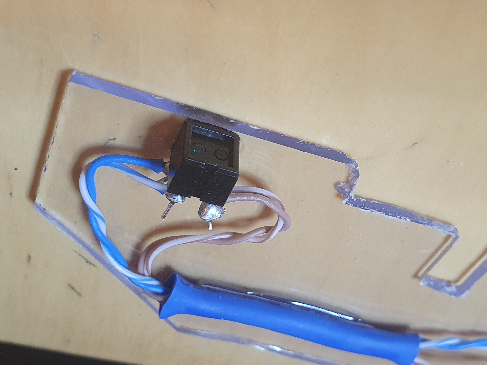
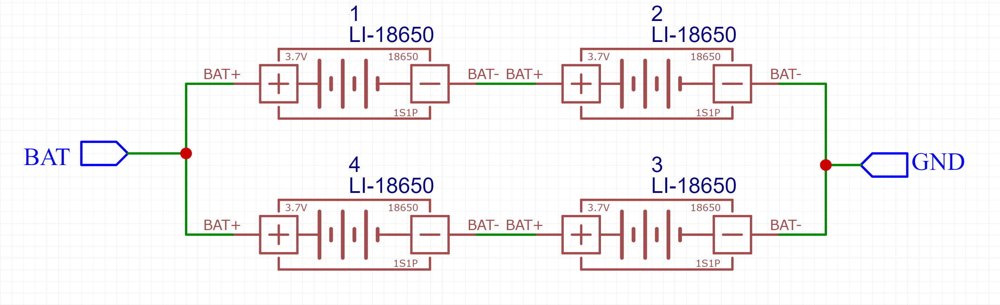
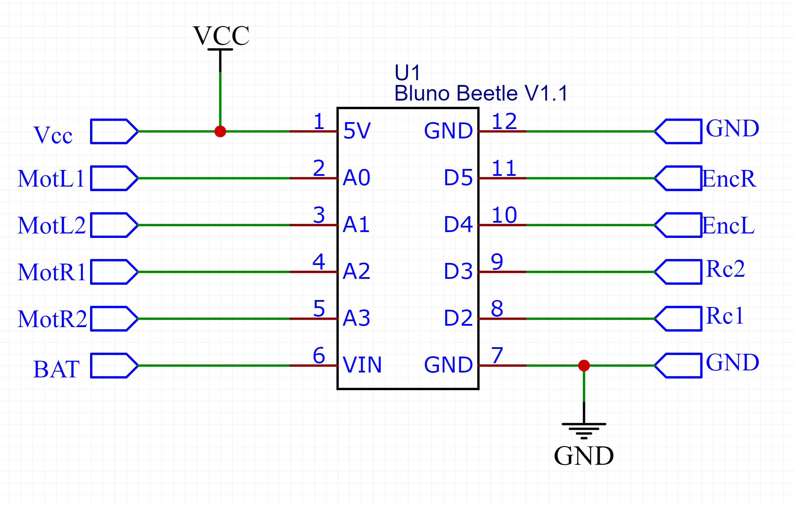
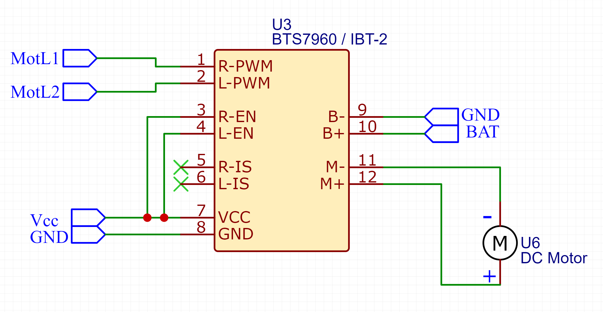
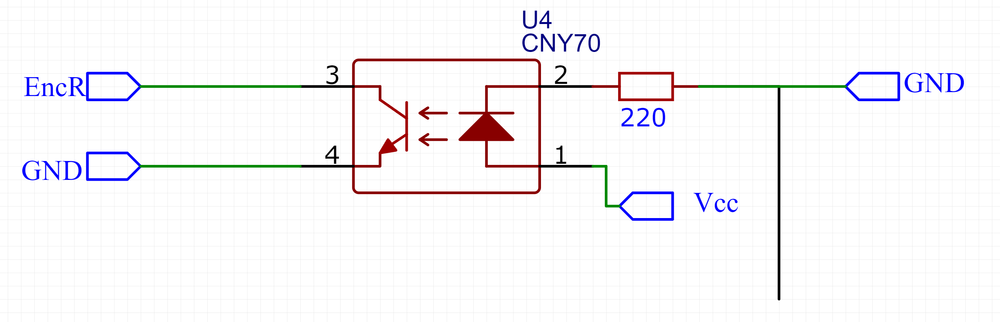

# RcBoatController Hardware and Electronics

[back to main page](README.md)

## Power supply
Knowing the desired voltage being ~8V and current consumption being more than 5A per motor, choosing li-ion cells in 2S configuration was quite a clear choice. For safety purpose, I prefer using protected cells. On the other hand, those protection circuits typically limit the output current. The cells I chose were rated at 10A max, so I decided to use four of them in 2S2P configuration. This setup should be fine to keep the motors running nicely.

The cells are kept together in a DIY holder. I bought the holders from ebay, but they were meant for relatively low current use, so I modified them with thicker current lines, again hidden behind a layer of hot glue.

## Power output circuit
At first, I used [DRV8871](https://www.ti.com/product/DRV8871)-based H-bridges to run the motors. They almost worked, but the driver chip got overheated and the current limiting protection activated too often, causing the motor to get jumpy and slow down occasionally during run.
After measuring the current consumption, it became clear that stronger driver circuits are needed. I ended up using [BTS7960](https://www.partco.fi/en/electromechanics/motors/motor-controllersdrivers/19263-bts7960b-modul.html)-based bridges, one per motor. They are too big for this purpose, but the boat benefits from some added middle weight and they fit nicely, so let them be. I have never got the cooling elements to heat up noticeably, so I almost believe they could be run even without the heat sinks in this use case.

## Radio control
I was told that the original product had a two lever controller, supposed to be used by two hands - one controlling the left side motor, the other one controlling the right side motor. I'm not a big fan of such control, so it was natural to go for a bit more user friendly approach for the replacement.
I found a controller+receiver kit for RC cars (see [here](https://www.rhs.fi/rc-tarvikkeet-1/radiolaitteet/radio/muut/maxam-e0105-xt-16-2-4ghz-3-kanals-rattradio.html)).

*note: images owned by the [seller](https://www.rhs.fi/)*

The kit works well and it was easy to interact with. The datasheet didn't tell much, but the output signals connected to an oscilloscope made it clear. Both channels provide a periodic pulse at 60Hz interval. The length of the pulses vary between ~1000us...~2000us, which made it straight forward to convert the pulse lengths to lever percentages.

## Speed feedback sensor
Being an engineer who enjoys over solved problems, I decided to add speed encoders to both axles to enable the controlled speed balancing of the motors. The main goal was to get the boat to run straight when not intentionally steered anywhere.

There was no space or suitable holder for mounting a normal rotary encoder disc, so I decided to create a DIY version of it. There were some [NERF darts](https://www.hasbro.com/common/productimages/fi_FI/CCCE147C5056900B10553FA593C070AD/converted1ffcb02be85a88a948de298296f6b2eaec526f63.jpg) available at my house, so I used one of them. Painted in matte black, glued with four narrow stripes of aluminium foil and sliding it on the axle, I ended up having something that can be used as an encoder. The only thing needed was an optical detector, where a pair of [CNY70's](https://www.vishay.com/docs/83751/cny70.pdf) became handy. One revolution makes the detector to see eight state transitions (dark->lit->dark->lit etc), which can then be counted by the microcontroller and converted to speed. Naturally, this kind of feedback sensor is not aware of direction of movement, but for the given use case, the directionless speed information was considered enough.

## Microcontroller board
I had some DFRobot Bluno Beetle boards as a leftover from earlier projects. That board has the ATMega 328P controller with a decent development board with enough connectivity around it, so I decided to use it for this. Being Arduino Uno compatible, the Arduino tool chain was the easiest way to get started.

The board is shown here:

## Schematics
The full schematic in PDF format is available [here](https://github.com/djtremolo/RcBoatController/blob/main/doc/schematics/schematic.pdf). Below, it is walked through in sections for convenience.

### Power supply
First of all, the power supply consists of 2S2P li-ion cells and the output voltage is provided in BAT and GND nets:

### Controller board
The main controller (Bluno Beetle) is fed with the battery voltage via VIN. Bluno then regulates it to 5V, which is then provided as output for the other boards via the 5V pin.

The used connections:
| Net | Bluno label | Direction | Signal Type | Usage |
| -- | -- | -- | -- | -- |
| MotL1 |A0 | OUT | Digital | PWM signal A for left motor driver |
| MotL2 |A1 | OUT | Digital | PWM signal B for left motor driver |
| MotR1 |A2 | OUT | Digital | PWM signal A for right motor driver |
| MotR2 |A3 | OUT | Digital | PWM signal B for right motor driver |
| Rc1 |D2 | IN | Digital | Throttle signal coming from radio receiver (Ch1) |
| Rc2 |D3 | IN | Digital | Steering signal coming from radio receiver (Ch2) |
| EncL |D4 | IN | Digital | Left axle encoder feedback signal |
| EncR |D5 | IN | Digital | Right axle encoder feedback signal  |
| BAT |SDA | IN | Analog | Battery level (internal analog reference 1.1V) |

### Motor driver
The driver is a full H-bridge and there are two of them - one per motor. The bridge is fed with separate logic and motor power lines (Vcc and BAT with common GND). The two PWM signals are used to control the motor voltage output to achieve variable speed drive.

### Radio controller interface
The radio control interface shown here is for visualization only. The pinout in the receiver is actually a 4x3 pin header with Vcc+GND supplied to radio receiver module and Ch1+Ch2 signals provided by it.

### Speed sensor interface
The speed sensor interface requires Vcc+GND for the emitting LED. In case of pointing the sensor to reflective surface, the EncX signal is pulled low via the included phototransistor. For this to work, there is a pull up resistor enabled at the controller side.

### Battery monitoring interface
Finally, the battery voltage is divided to max 1.1V and then fed to A4(SDA) pin of the controller, where an ADC is used to make it readable by the software. Internal 1.1V analog reference is used for the conversion.

[back to main page](README.md)
