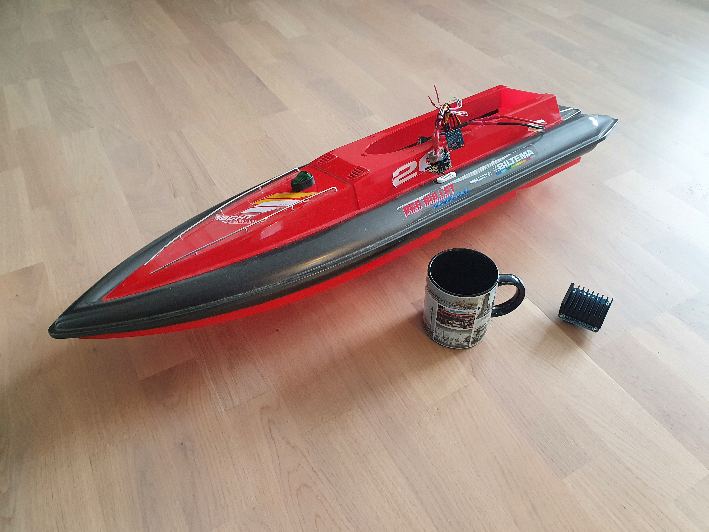
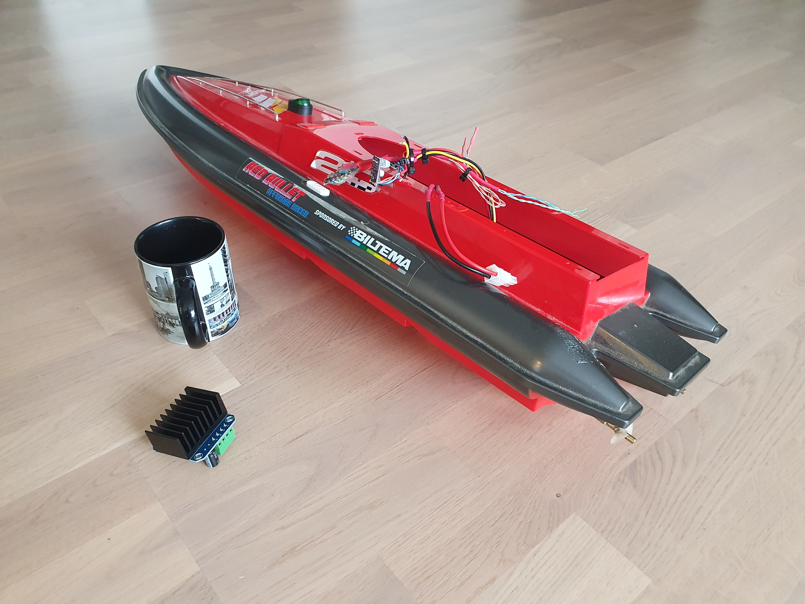
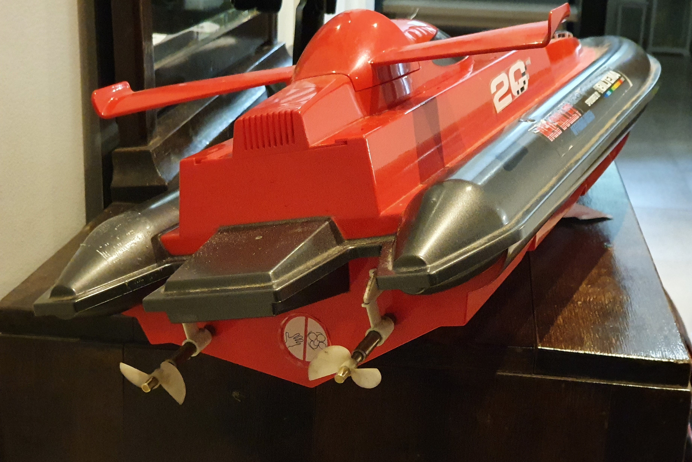

# RcBoatController Overview

[back to main page](README.md)

## History
The boat frame has been apparently bought originally from Biltema some years ago. At some point, the radio controller had been lost, as well as the battery. The boat body was then handed by the original owner to my father-in-law who is known as a man who can fix anything. The boat was stored for some time as a "future project" and then handed to me later.
I googled a bit and didn't find much info of the boat, neither were the suitable radio controllers available on ebay. So, it started look like a DIY project.

## Boat frame
The boat frame is made of plastic and being relatively big, it has plenty of space for new things. The propellers, axles and motors were in good shape, so I saved them and removed the rest: original speed controller and wiring.

## Motors
The model/manufacturer of motors is not known, but they are pretty normal brushed DC motors. Using a lab power supply, it looks like they operate nicely at around 8 volts. More than that makes them run "too fast". Unfortunately, my power supply can deliver only 5A, so I was not able to measure the peak current consumption of the power line, but the motor behaviour seems to be significantly bigger than 5A per motor. Naturally, the current consumption is dependent on the situation. At start-up and in low duty cycle PWM drive, the current consumption is jumpy.

## Test Drive

[Link to test drive video on Youtube](https://youtu.be/F3i1ZTXYGnA)

[back to main page](README.md)
