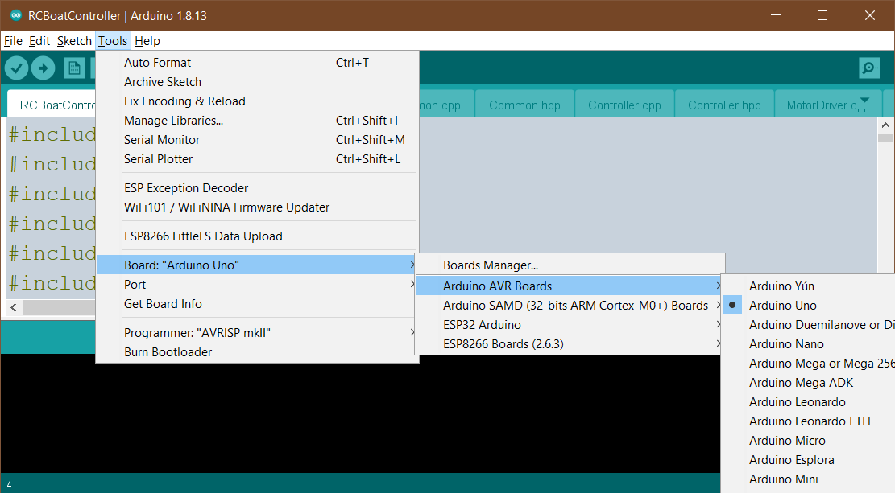

# RcBoatController Software

[back to main page](README.md)

## Build environment
The software structure is designed to be built with Arduino IDE. During development, version 1.8.13 was used. Use "Arduino UNO" as build target to get the IDE working with Bluno Beetle.

## External libraries
As the ATMega328P has only two external input pins, and they are already used by the Radio Receiver, the speed encoder input signals needed something else. Luckily, the AVR family provides the state change interrupt support for most of the GPIO pins. To simplify setting up these IRQs, I used the [PinChangeInterrupt](https://www.arduino.cc/reference/en/libraries/pinchangeinterrupt/) library for them.

## System view
The software consists of the functional modules further defined in the chapter [Modules](#1-modules). The RcBoatController.ino is the main source file to make the Arduino IDE happy. The modules are then split into separate files for making the program easier to read.

## Modules
The modules are shown in the following figure, which shows the initialization sequence at start-up. The interface functions of each module are labeled with a three-letter prefix to indicate the module to which they belong to:
| Prefix | Module name | Purpose |
| -- | -- | -- |
|mot|MotorDriver|Power output. Takes in the requested left+right motor output values and drives the four PWM channels accordingly.|
|ctr|Controller|Boat movement control. Takes in throttle+direction values and converts them to motor output values. Uses the measured speed information to adjust the output values if needed.|
|rcr|RcReceiver|Radio control receiver. Follows the radio control pulses and converts them to throttle+direction values.|
|enc|SpeedEncoder|Speed encoder. Keeps track of the axle speeds and outputs measured speed information to be used by the controller.|
|btm|BatteryMonitor|Battery level monitoring. Measures battery level and can be used to ensure the boat safely return to the user.|
|com|Common|Any general purpose functions used by the other modules. This module does not depend on any other module.|

The modules are further explained in the following chapters.

## Main program
The overall boat speed control follows a periodical scheme, where the basic program flow is:
- read input values (from radio receiver and speed encoder)
- calculate new output values based on the user request (information from radio receiver)
- calculate the adjustment factor to make the *requested* and *measured* speed to match (information from speed encoder)
- write adjusted output values to motor driver
- while waiting for next cycle, handle maintenance tasks (monitoring for battery level, radio signal validity etc)
- start again

This control loop is run at 25ms interval.

At program start up, the modules are initialized using their *xxx_initialize()* functions:

The basic program flow defined in this chapter will then start operating at the main function:

## Controller

The Controller module provides two interface functions to be used by the main program. 

The *ctr_speedControl()* function calculates the direct output values based on the user input, i.e. the output value pretty much follows the throttle value. This is completely unaware of the actual speed of the axle, it only cares about the requested drive percentage. This would be enough for the simple drive of the boat.

The output values prepared by the *ctr_speedAdjust()* function that is aware of both *requested* and *measured* speed of the motors. The adjustment will then compensate the output value to keep the axles spinning the correct speed regardless of any physical factors that would affect the speed. Naturally, the adjustment cannot make the motor to spin more than 100% of the drive cycle, but the compensation is more visible at the lower speeds. Brushed DC motors in general deliver low torque when being driven with low duty cycle PWM. This problem can be somewhat solved with speed adjustment: when the adjustment expects the motor to be moving, but it is stalled due to low torque, the speed adjustment can raise the speed request and therefore "kickstart" the motor so that it starts moving. After the movement is detected, the speed adjustment automatically lowers the requested speed to avoid it being too fast.

These functions, called in this given order, will then together produce the real requested output value to be written to the motor driver.

## MotorDriver
The MotorDriver module is responsible of driving the PWM channels needed for the motor H-bridges. There are two signals needed per each motor bridge: the first one for forward and the second one for reverse drive.

The brushed DC motor behaviour with these two signals:

|H-Bridge inputs|2=HIGH|2=LOW|
|--|--|--|
|**1=HIGH**|Brake|Forward|
|**1=LOW**|Reverse|Coast|

Typically, when driving a brushed DC motor with such bridge using PWM, it is recommended to *drive* to desired direction during active duty cycle and to *brake* for the rest of the cycle. The *brake* does not mean stopping the motor though, the motor just drives better with this practice. The PWM switching frequency is flexible and varies between 500Hz at lowest throttle, 1kHz at highest throttle level. This is to make the audible squeal caused by switching be less irritating and also to make the power output efficiency better on low speed drive.

In the ATMega328, there are only two PWM outputs available, and we need four of them. Therefore, the PWM output generation had to be implemented otherwise. Internally, the PWM generation is run by a timer ISR ticking at 50kHz. Assuming we run at low speed (using 500Hz switching), the PWM output generation has 100 ticks to operate. With the motor output value X being an integer between 0%...100%, it is  straightforward to just keep the output signal active for X ticks and then deactivate it for the rest of the cycle. After the cycle is done, the ISR fetches new instructions for the next cycle, which may be different in length - that is defined by the requested output values.

The MotorDriver operates independently for both motors, i.e. in the typical usage scenario, the motor PWM cycles do not start at the same tick, as they drift apart because of the flexible PWM cycle width. This improves the power balancing, as the motors consume highest current at the moment of switching to active drive. With the flexible drive cycle, these high consumption peaks are statistically distributed apart from each other.

The *mot_valueSet()* function sets the power output request value for the given motor. The value is not taken into use immediately. When both motor output values are set, the next call of *mot_outputUpdate()* will then activate the requested values for PWM generation and the new values are taken into use when the PWM cycle of given motor is finished.

## RcReceiver

## SpeedEncoder

## BatteryMonitor

## Common

[back to main page](README.md)

